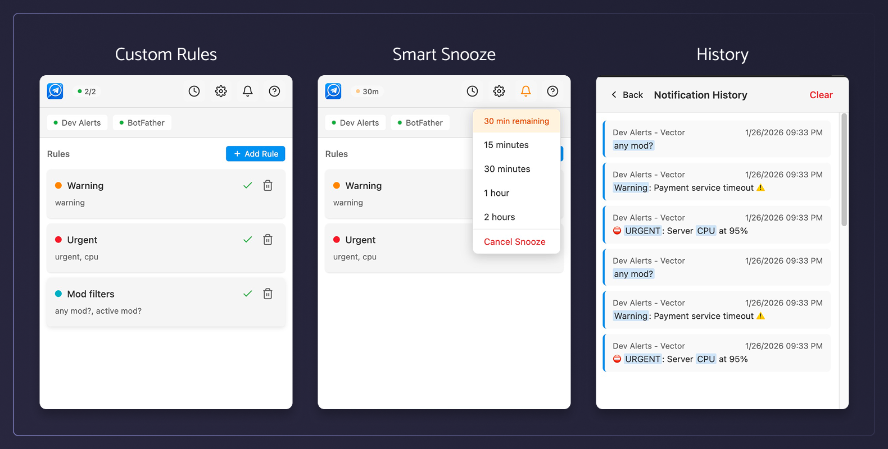

<p align="center">
  
</p>

<h1 align="center">Telegram Keyword Alert</h1>

<p align="center">
  Custom keyword and user-based notifications for Telegram Web
</p>

<p align="center">
  
  
  
</p>

<p align="center">
  
</p>

---

## Features

- **Keyword Alerts** — Get notified when specific keywords appear in messages
- **User Monitoring** — Track messages from specific users
- **Chat Filtering** — Monitor specific chats or watch all conversations
- **Snooze** — Temporarily pause notifications when you need focus time
- **Multiple Notification Types** — Browser notifications, in-page toasts, sound alerts
- **Theme Support** — Light, dark, or system preference
- **Data Portability** — Export/import your settings and rules

## Installation

### From Store

<p align="center">
  <a href="#" target="_blank">
    
  </a>
  &nbsp;&nbsp;
  <a href="https://addons.mozilla.org/en-US/firefox/addon/telegram-keyword-alert/" target="_blank">
    
  </a>
</p>

### Manual Installation

<details>
<summary><strong>Chrome / Edge / Brave</strong></summary>

1. Download the latest `.zip` from [Releases](../../releases)
2. Extract the zip file
3. Go to `chrome://extensions`
4. Enable **Developer mode** (top right)
5. Click **Load unpacked**
6. Select the extracted folder

</details>

<details>
<summary><strong>Firefox</strong></summary>

1. Download the Firefox `.zip` from [Releases](../../releases)
2. Go to `about:debugging#/runtime/this-firefox`
3. Click **Load Temporary Add-on**
4. Select the downloaded `.zip` file

> Note: Temporary add-ons are removed when Firefox closes.

</details>

## Development

**Prerequisites:** Node.js 18+, pnpm

```bash
# Install dependencies
pnpm install

# Start dev server
pnpm dev            # Chrome
pnpm dev:firefox    # Firefox

# Build for production
pnpm build          # Chrome
pnpm build:firefox  # Firefox

# Create distribution zip
pnpm zip
pnpm zip:firefox
```

## License

MIT
